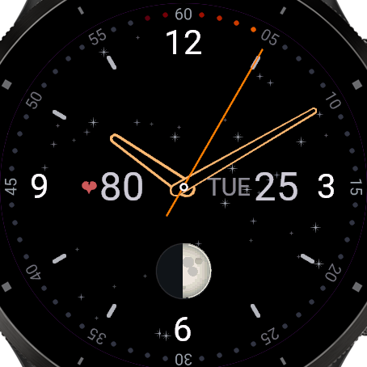
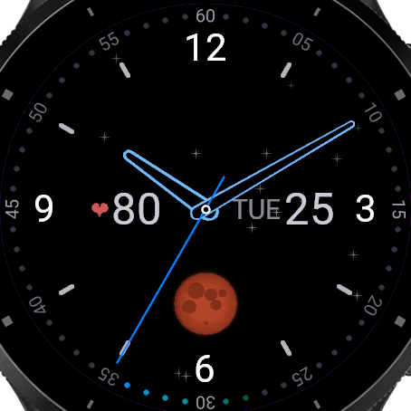
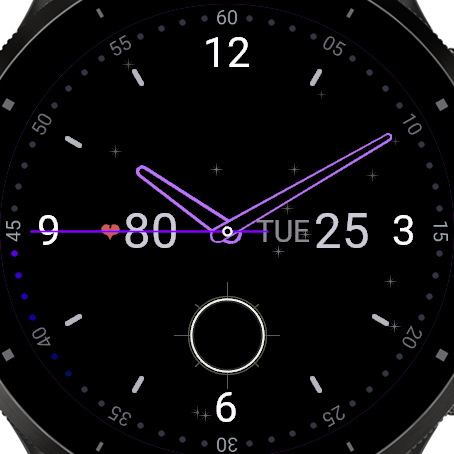
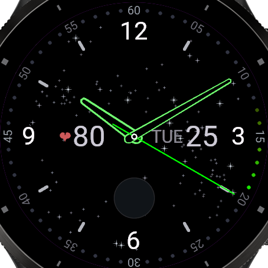

# Moon Phase Astro

An analog watch face for the **Garmin Venu 3 / Venu 3S**. The moon at 6
o'clock is the real one — shaded as a sphere, in tonight's phase, turning copper
when the Earth's shadow crosses it. Behind the hands is a sky that dims as the
moon fills. On a pure-black, AMOLED-friendly dial, with a second hand that
sweeps the spectrum once a minute.


<p align="center">
  
</p>

---

## The moon

Not a set of eight cut-out icons. The disc is shaded a scanline at a time: the
surface normal of a sphere gives a Lambert term, so the terminator falls off as
a gradient and the limb darkens the way a real moon does. The lunar maria are
part of the same ramp, so they shade with the surface and are clipped by the
terminator — they appear and vanish through the month exactly where they should.

The phase itself is computed on the watch from the mean synodic month, off no
network and no phone.

## Eclipses

During a lunar eclipse the disc turns copper; during a solar one it is occulted
and grows a corona. Every eclipse from **2025 to 2045** — 93 events — is built
in from the NASA GSFC catalogue, so the dates and magnitudes are exact rather
than estimated. Past 2045 the face falls back to computing them on the watch
from Meeus' node math, which is [validated against every event in the
table](docs/DEVELOPMENT.md#eclipse-math) rather than assumed correct.

Optionally the effect is gated on whether the eclipsed body is actually above
your horizon. That check uses the **last known** GPS position only — it never
asks for a fix, so it costs no battery — and it fails open: no position means
the eclipse is shown, never hidden. Penumbral lunar eclipses are detected and
deliberately not drawn, because they look like nothing in the sky.

| Lunar eclipse | Solar eclipse |
|---|---|
|  |  |

## The sky behind the dial

A field of up to 200 stars, gathered along a bowed band across the dial — the
Milky Way — with a sparser scatter elsewhere. Each star carries a magnitude,
and **moonlight washes the field out**: near a new moon the whole sky shows, by
first quarter the band is gone, and a full moon leaves about a dozen bright
anchors, dimmed as well as thinned. The sky is a second reading of the same
phase the disc shows.

| First quarter | New moon |
|---|---|
|  |  |

Same `Stars` setting in both shots. The difference is only how much of the sky
the moon is letting through.

Or swap the field for a **zodiac constellation** — the principal stars of any of
the twelve, alone or joined by the conventional lines. Astronomy only: no sign
glyphs, no figures. Left on Auto it follows the Sun's current sign through the
year.

## The dial

The second track is the outermost thing on the face: sixty positions round the
rim, 48 tick dots and 12 five-second numerals **sharing one ring**, each numeral
set radially in place of the dot it would have covered. `drawText` cannot
rotate, so those labels are rasterised once at layout and blitted through an
affine transform thereafter.

The hour marks have three styles — full numerals, numerals at 12/3/6/9 with bold
ticks between, or ticks alone — and can be moved out to the second track's
radius if you want the hours large and the rim busy.

## The hands

One silhouette, drawn well: a tapered baton capped at both ends by a circle and
sided by the two external tangents of those circles, emitted as a single closed
polygon so the cap can never sit a pixel off the shaft.

They take nine colours — eight fixed presets, or **Spectrum**, where they ride
the same hue as the second hand and the whole time display turns through the
wheel once a minute. Every shot on this page is that one setting, caught at a
different second: orange, green, blue, violet, all within the same minute. A
hollow setting cuts an even-bordered channel down the middle, from solid through
to a hairline outline.

The second hand is always the spectrum needle, and it trails a comet down the
track behind it — one hue fading back, a scatter of hues from around the wheel,
or the same over a permanently dim colour wheel.

## The rest

- **Complications** — a classic `FRI 27` date at 3 o'clock, heart rate with a
  heart glyph at 9 o'clock.
- **Always-on aware** — in low power the background, the comet and the second
  hand drop out and the hands become dimmed wireframes that keep their colour
  instead of reverting to grey. The whole composition drifts a few pixels on a
  four-minute cycle so no pixel stays lit.
- **One code path, both sizes** — every dimension is a fraction of the screen
  radius, so the Venu 3 (454 px) and Venu 3S (390 px) render from the same
  source with no per-device layout.
- **Rainbow wave** — a band of spectrum washing outward across the marks and
  numerals every few hours. Written, scheduled and unit-tested, but **compiled
  out of the current build** while the frame budget is being tuned; see
  [DEVELOPMENT.md](docs/DEVELOPMENT.md#features-currently-switched-off).

## Settings

In **Garmin Connect → the watch face → Settings**, or in the simulator under
**Settings → Watchface Settings**.

| Setting | Default | Notes |
|---|---|---|
| Comet trail | Spectrum trail | Classic single hue, spectrum trail, or spectrum ring |
| Comet crosses the numerals | off | On, the trail runs unbroken through the five-second marks |
| Show orbit ring | off | The faint dotted circle inside the hour numerals |
| Hand colour | Spectrum | Or one of eight fixed presets |
| Hollow hands | 50 | 0 is solid, 80 a hairline outline |
| Background | Starfield | Or a zodiac constellation, with or without lines |
| Zodiac sign | Auto | Auto follows the current sun sign |
| Stars | 120 | 0–200; how many the moon lets through varies with the phase |
| Show hour numerals | on | |
| Hour numerals on outer ring | off | Moves them to the second track, bigger and upright |
| Hour mark style | Numerals + lines | Numerals, numerals + lines, or lines only |
| Show second numerals | on | |
| Rainbow wave | on | No effect in this build — the wave is compiled out |
| Rainbow wave start hour | 0 | |
| Hours between waves | 3 | 24 gives one wave a day |
| Eclipse effects | on | |
| Show eclipses | Always | Or only when above your horizon (last known GPS, never requests a fix) |
| Eclipse data | Built in through 2045 | Or always calculate on the watch |

Two read-only diagnostics (**Eclipse data status**, **Last position used**) are
written back by the face, and a group of test switches can force an eclipse,
shift the astronomy clock, park the hands at a fixed time, override the position
and fire the wave every minute. See [`docs/eclipse-test-dates.md`](docs/eclipse-test-dates.md).

## Install

Build the `.prg` matching your watch and copy it into `GARMIN\APPS\` over USB.
Full step-by-step instructions, including the Garmin Express gotcha and
on-watch debugging, are in [`INSTALL.md`](INSTALL.md).

## Build from source

Needs the [Connect IQ SDK](https://developer.garmin.com/connect-iq/sdk/) (min
API 5.2.0) and a Java runtime — Temurin/Adoptium JDK 17 or 21. The script finds
both and signs both watch sizes into `bin\`:

```powershell
.\build.ps1              # release builds for venu3 and venu3s
.\build.ps1 -Debug       # debug builds, for the simulator
.\run-simulator.ps1      # build and open in the simulator (or: run-simulator.ps1 venu3s)
```

## Contributing and internals

[`docs/DEVELOPMENT.md`](docs/DEVELOPMENT.md) is the map: what each module does,
where the tuning constants live, what the frame actually costs on hardware, how
the screenshots and the eclipse table are generated, and the Connect IQ
platform limits that shaped the code.

## License

Released under the [MIT License](LICENSE). Copyright (c) 2026 Anton Velmozhnyi.

Eclipse circumstances are derived from the NASA GSFC eclipse catalogue (Fred
Espenak), which is in the public domain.
