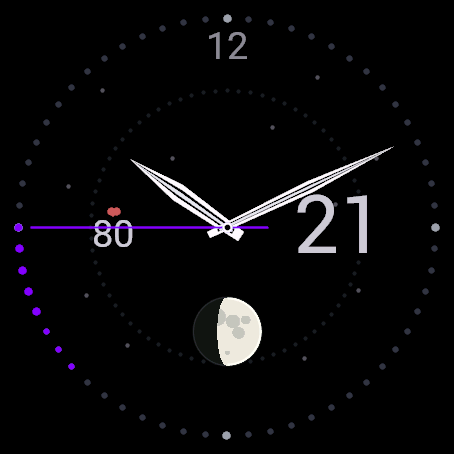

# Moon Phase Astro

An analog watch face for the **Garmin Venue 3 / Venue 3S** that shows the real
current moon phase, the day of the month, and your heart rate — on a pure-black,
AMOLED-friendly dial with a rainbow second hand.


<p align="center">
  
</p>

## Features

- **Real moon phase** — a warm off-white moon subdial at 6 o'clock with actual
  lunar maria that are clipped by the terminator, so the craters appear and vanish
  correctly as the phase progresses through the month. The math is computed
  on-device (see `source/MoonPhase.mc`) and verified against known lunar dates.
- **Analog dial** — monochrome geometric hollow-blade hour and minute hands over a
  sparse fixed starfield and a faint dotted orbit ring.
- **Spectrum second hand** — the only colour on the face; its hue sweeps the full
  spectrum once per minute, trailing a short comet tail of the same hue.
- **Complications** — day of the month at 3 o'clock, heart rate (with a heart
  glyph) at 9 o'clock.
- **Always-on aware** — in low-power mode the colour and ornamentation drop to a
  dim wireframe, and the whole face drifts a few pixels on a slow cycle to protect
  against burn-in.
- **Easily re-themed** — edit the constants at the top of `source/Theme.mc`.

## Requirements

- A **Garmin Venu 3 (45 mm)** or **Venu 3S (41 mm)** watch.
- To build from source: the [Garmin Connect IQ SDK](https://developer.garmin.com/connect-iq/sdk/)
  (min API level 5.2.0) and a working Java runtime (Temurin/Adoptium JDK 17 or 21
  recommended).

## Build

The included PowerShell script locates the Connect IQ SDK and a working Java
runtime, then produces signed `.prg` files for both watch sizes in `bin\`:

```powershell
.\build.ps1              # release builds for venu3 and venu3s
.\build.ps1 -Debug       # debug builds (for the simulator)
```

> Note: this project ships build scripts that work around a broken Oracle
> "javapath" Java stub by calling the compiler with a known-good JRE directly. If
> your `java` on PATH already works, the scripts use it automatically.

## Preview in the simulator

```powershell
.\run-simulator.ps1            # or:  .\run-simulator.ps1 venu3s
```

This builds the face and opens it in the Connect IQ simulator, where you can use
**Settings > Time** and the power-mode toggles to watch the moon phase, the
spectrum second hand, and the always-on look.

## Install on your watch

Build the `.prg` that matches your watch, then copy it into the watch's
`GARMIN\APPS\` folder over USB (MTP). Full step-by-step instructions — including
the Garmin Express gotcha and on-watch debugging — are in [`INSTALL.md`](INSTALL.md).

## Project layout

| File | Purpose |
|------|---------|
| `manifest.xml` | App metadata; targets venu3 + venu3s, min API 5.2.0 |
| `monkey.jungle` | Build configuration |
| `source/MoonPhaseAnalogApp.mc` | App entry point |
| `source/MoonPhaseAnalogView.mc` | All rendering (dial, hands, moon, complications) |
| `source/MoonPhase.mc` | Lunar phase math (no UI) |
| `source/Complications.mc` | Day + heart rate lookups |
| `source/Theme.mc` | Colour palette + hue helper |
| `resources/` | App name, launcher icon |
| `build.ps1` | One-command build for both sizes |
| `run-simulator.ps1` | Build + open in the simulator |
| `INSTALL.md` | Detailed sideloading guide |

## License

Released under the [MIT License](LICENSE). Copyright (c) 2026 Anton Velmozhnyi.
